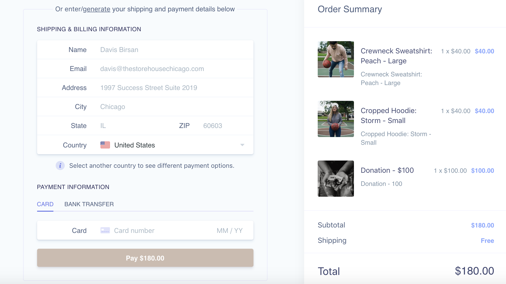
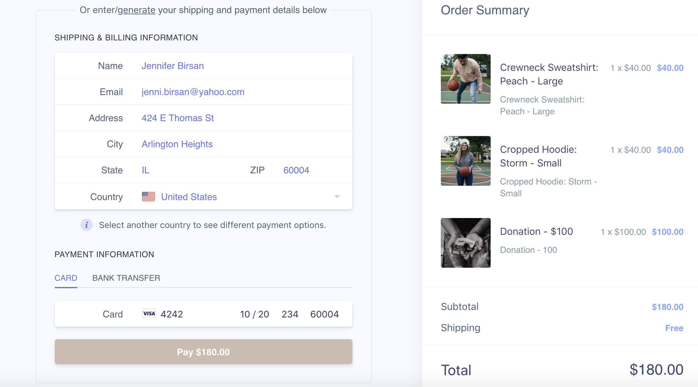
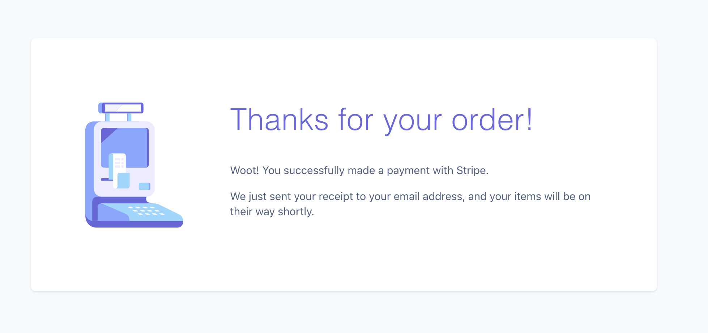
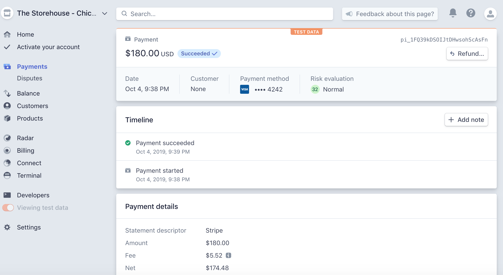
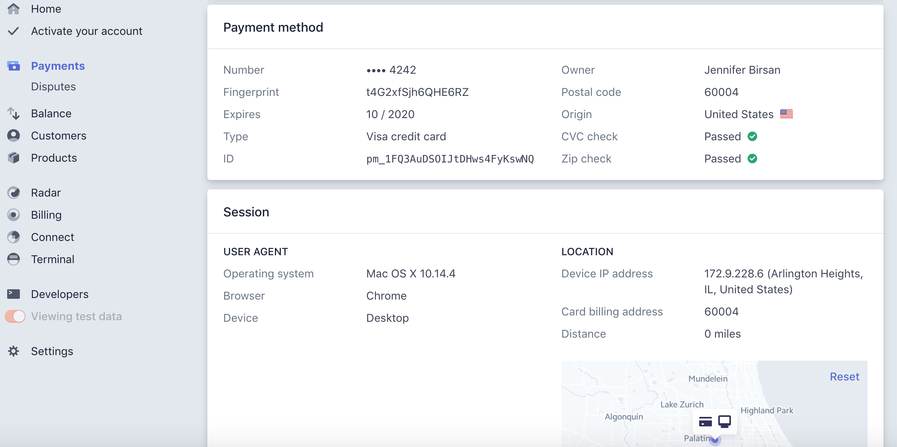
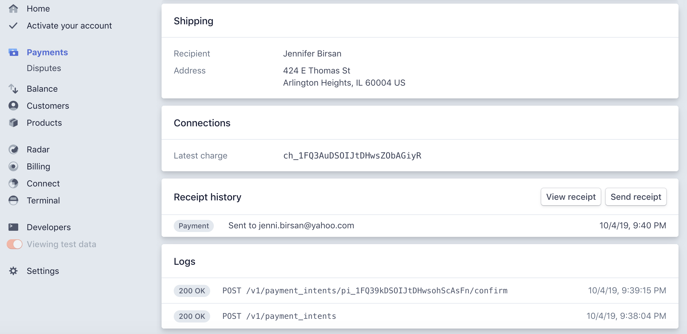
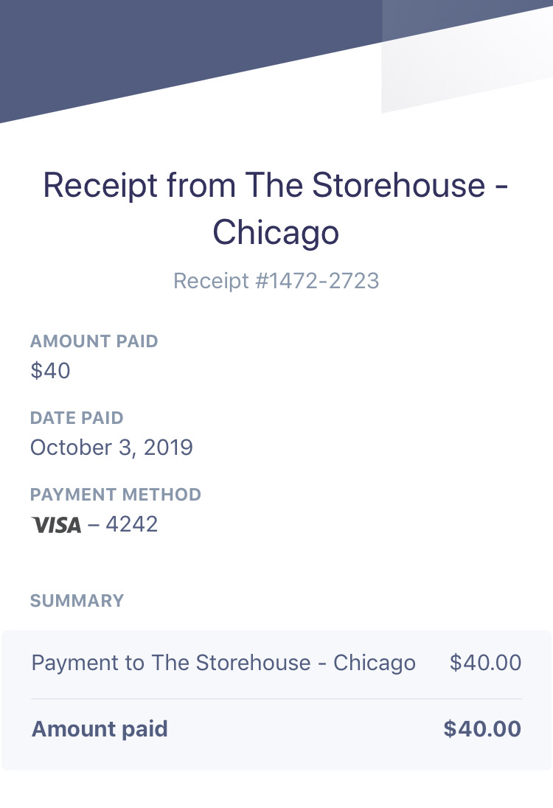

# Stripe Payments Demo

This directory contains the main Node implementation of the payments server using Stripe for the project: The Storehouse Chicago.

### Main Project

The main project is The Storehouse - Chicago.

- Github: https://github.com/daveyjonezz/theStorehouseChicago.git
- Heroku: https://thestorehousechitown.herokuapp.com/ 
- Stripe Heroku:

The Stripe integration is its own seperate deployment that connects via API to the Storehouse Chicago. They run on two seperate servers. This integration functions after you click the cart button on the main project. 

### About

To Test: Enter all shipping/billing information or you can click "generate" at the top to place a random address. For the credit card, enter Stripe's test card number (4242 4242 4242 4242) and a future expiration data and a random 3 digit cvv code. Once you click "Pay", it will confirm your order and submit it to the back end of Stripe. Please see screenshots below.

## Checkout Page
(this is the main page with an item in the cart)

## Entering Info
(this is the checkout portion where you fill in your shipping/billing info)

## Order Placed
(this is will appear once order is processed successfully)

## Backend
(this is will appear on the Stripe backend once a order has been successfully purchased)

## Receipt
(a receipt will be sent to your email once you made a purchase)

### Credits

I used the following Stripe Demo as my boiler plate for The Storehouse Chicago: 
https://stripe-payments-demo.appspot.com/. It was found on Stripe's main website as a boiler plate to use as you are integrating Stripe for personal use. 

- Code for the boiler plate by: [Romain Huet](https://twitter.com/romainhuet) and [Thorsten Schaeff](https://twitter.com/thorwebdev)

- Edited and Configured by: Jenni Birsan (IG: jennibirsan)